# Veridicta

> **RAG-powered AI assistant for reliable, explainable Monegasque labour law answers.**

---

## 1. Vision

Assistant conversationnel juridique specialise en **droit du travail monegasque**, combinant **Hybrid RAG (BM25 + FAISS)**, **prompt engineering avance** et un **LLM multi-backend** (Cerebras Cloud ou GitHub Copilot) pour delivrer des reponses precises, sourcees et tracables a destination de **juristes et avocats professionnels**.

## 2. Resultats

Resultats finaux valides (100 questions gold standard, backend Copilot `gpt-4.1`, corpus v3 49 263 chunks, Solon embeddings 1024d).

### Comparaison des architectures

| Architecture | KW Recall | Word F1 | Cit.Faith | Context Cov | Latence |
| --- | --- | --- | --- | --- | --- |
| Hybrid k=5 (baseline) | 0.363 | 0.267 | 0.990 | 0.517 | 8.98 s |
| Hybrid k=8 (Solon+bm25s+v3) | **0.608** | 0.318 | **1.000** | **0.733** | 15.10 s |
| Graph RAG (LightRAG) | 0.481 | 0.256 | 0.470 | 0.449 | 7.70 s |
| **Hybrid+Graph k=5** | 0.552 | **0.338** | **1.000** | 0.742 | 23.4 s |

**Configuration optimale production** :

- **Retrieval**: Hybrid+Graph (`hybrid_graph_rag.py`) — BM25+FAISS seed → expansion Neo4j 4 types d'aretes
- **k-value**: 5 chunks (meilleur F1 et CitFaith)
- **Prompt**: Version 3 (structure bullet points + citation explicite numeros de loi)
- **Embeddings**: `OrdalieTech/Solon-embeddings-large-0.1` (1024d, francais legal)
- **Knowledge Graph**: Neo4j 5 — 5 959 Doc / 49 263 Chunk / 5 255 Article / 4 types d'aretes
- **Conversation**: Multi-tour (3 derniers echanges, reedition de requete courte)
- **Streaming**: Token-by-token via SDK `@github/copilot-sdk` v0.1.32

**KPIs v1.x atteints** :

| Indicateur | Cible | Resultat | Statut |
| --- | --- | --- | --- |
| Keyword Recall | >= 55 % | **60.8 %** | Atteint |
| Word F1 | >= 28 % | **31.8 %** | Atteint |
| Citation Faithfulness | >= 99 % | **100 %** | Atteint |
| Context Coverage | >= 60 % | **73.3 %** | Atteint |
| Cout variable | 0 EUR | **0 EUR** | Atteint |

## 3. Stack technologique

| Composant | Choix |
| --------- | ----- |
| **Langage** | Python 3.11 |
| **Embeddings** | `OrdalieTech/Solon-embeddings-large-0.1` (local, dim 1024) |
| **Retrieval** | **Hybrid bm25s+FAISS** (RRF, k=60) -- FAISS 0.3 / BM25 0.7, stemming francais PyStemmer |
| **LLM** | Cerebras Cloud (`gpt-oss-120b`) ou GitHub Copilot (`gpt-4.1`) via `github-copilot-sdk` Python natif |
| **Artifacts** | HF Hub dataset `Fascinax/veridicta-index` -- FAISS+bm25s+chunks auto-telecharges (180 MB) |
| **UI** | Streamlit (chat, sources cliquables, toggle FAISS/Hybrid) |
| **Knowledge Graph** | Neo4j 5 (Docker local) — 5 959 Doc / 49 263 Chunk / 5 255 Article / 4 types d'aretes |
| **Evaluation** | 100 questions gold standard, KW recall, F1, citation faithfulness, context coverage, hallucination risk + Ragas (`Faithfulness`, `ContextPrecision`) |
| **Scraping** | API Elasticsearch LegiMonaco + Playwright Journal de Monaco |
| **Deploy** | Streamlit Cloud (artifacts depuis HF Hub au boot, ~2 min) |

### Hors scope (v2+)

- QLoRA fine-tuning (pas de GPU, prompt engineering d'abord)
- Guardrails (LlamaGuard) — prompt-level guardrails suffisent
- Monitoring (Prometheus, wandb) — logs fichier suffisent
- Deploiement cloud full-prod (k8s)
- Droit francais / droit civil monegasque

## 3.1. Tests & Qualite

```bash
# Lancer tous les tests avec couverture
pytest tests/ -v --cov=. --cov-report=term-missing --cov-report=html
```

**Resultats actuels** (121 tests, 1 skipped) :
- 📊 **Modules couverts** :
  - `tools/copilot_client.py` : **98%** (SDK Python natif)
  - `retrievers/reranker.py` : **84%**
  - `retrievers/artifacts.py` : **82%** (download + upload HF Hub)
  - `retrievers/lancedb_rag.py` : 16 tests (vector, hybrid, FTS, build-from-FAISS)
  - `retrievers/neo4j_setup.py` : **41%** (extracteurs regex + guard clauses)
- ⚠️ **Modules a ameliorer** :
  - `eval/evaluate.py` : 26%
  - `retrievers/neo4j_setup.py` : fonctions batch Neo4j non testees (besoin instance)

**Rapport HTML detaille** : `htmlcov/index.html` (genere apres execution des tests)

## 3.2. Benchmarks de performance

Suite de benchmarks pour mesurer la performance du pipeline RAG.

```bash
# Installer pytest-benchmark
pip install pytest-benchmark memory-profiler

# Lancer tous les benchmarks
pytest tests/test_performance.py --benchmark-only

# Sauvegarder une baseline
pytest tests/test_performance.py --benchmark-only --benchmark-save=baseline

# Comparer avec la baseline
pytest tests/test_performance.py --benchmark-only --benchmark-compare=baseline

# Exporter en JSON
pytest tests/test_performance.py --benchmark-only --benchmark-json=perf_results.json

# Comparer deux snapshots de benchmarks
python -m eval.compare_benchmarks --old eval/results/benchmarks/perf_full_YYYYMMDD_HHMMSS.json --new eval/results/benchmarks/perf_full_YYYYMMDD_HHMMSS.json

# Auto-comparer les deux derniers snapshots
python -m eval.compare_benchmarks

# Benchmarks specifiques (sans les tests slow)
pytest tests/test_performance.py::TestChunkingPerformance --benchmark-only

# Sauter les benchmarks lors des tests normaux
pytest tests/ -m "not benchmark"
```

**Benchmarks disponibles** :

| Categorie | Tests | Metriques |
|-----------|-------|-----------|
| **Chunking** | `test_chunk_single_document`, `test_clean_text` | ops/sec, stddev |
| **Embeddings** | `test_embed_single_query`, `test_embed_batch_queries` | latence query/batch |
| **Retrieval** | `test_faiss_retrieve_k5`, `test_hybrid_retrieve_k5` | latence moyenne 5 queries |
| **Memory** | `test_memory_faiss_index_load`, `test_memory_embedding_model_load` | peak/retained MB |
| **End-to-end** | `test_e2e_rag_latency` | latence totale retrieve+generate |

**Resultats typiques** (machine locale, CPU):

```
test_chunk_single_document     : 1.23 ms per op (±0.15 ms)
test_faiss_retrieve_k5         : 42.5 ms per query (±3.2 ms)
test_hybrid_retrieve_k5        : 51.8 ms per query (±4.1 ms)
test_memory_faiss_index_load   : Peak 350 MB, Retained 280 MB
test_e2e_rag_latency          : 8.2 s (retrieval + LLM generation)
```

**Best practices** :
- Lancer benchmarks sur machine dediee (pas en parallele avec autre charge)
- Utiliser `--benchmark-warmup=on` pour stabiliser resultats
- Comparer systematiquement avec baseline avant merge
- Tracker JSON dans repo pour historique performance

## 4. Arborescence du depot

```text
Veridicta/
+-- data_ingest/
|   +-- legimonaco_scraper.py   # API Elasticsearch LegiMonaco (legislation + jurisprudence)
|   +-- monaco_scraper.py       # Scraper Playwright du Journal de Monaco
|   +-- monaco_integrator.py    # Deduplication et integration des corpus
|   +-- data_processor.py       # Chunking 1800 chars + overlap -> JSONL
+-- retrievers/
|   +-- baseline_rag.py         # FAISS retrieval + LLM generation (Cerebras ou Copilot)
|   +-- hybrid_rag.py           # bm25s + FAISS + RRF fusion (stemming francais PyStemmer)
|   +-- graph_rag.py            # FAISS seed + expansion aretes Neo4j (CITE, CITE_ARTICLE, ...)
|   +-- hybrid_graph_rag.py     # Hybrid+Graph : BM25+FAISS seed → Neo4j expansion → ranking
|   +-- lancedb_rag.py          # LanceDB vector+FTS+RRF (store unifie, remplace FAISS+bm25s)
|   +-- neo4j_setup.py          # Construction graphe Neo4j (Doc, Chunk, Article, aretes)
|   +-- reranker.py             # FlashRank MultiBERT (ONNX, CPU-only, multilingue)
|   +-- traceability.py         # Audit trail JSONL + trace prompt-window + multi-tour
|   +-- artifacts.py            # Download/upload auto FAISS+bm25s+chunks depuis HF Hub
+-- tools/
|   +-- copilot_client.py       # Client GitHub Copilot via github-copilot-sdk (Python natif)
+-- eval/
|   +-- evaluate.py             # Metriques multi-modeles (--retriever faiss|hybrid|graph|hybrid_graph|lancedb)
|   +-- ragas_support.py        # Metriques Ragas (Faithfulness, ContextPrecision)
|   +-- plot_architectures.py   # 6 graphiques comparatifs des architectures
|   +-- test_questions.json     # 100 questions gold standard droit du travail MCO
|   +-- results/                # Resultats eval par backend/retriever
|   +-- charts/                 # Graphiques de comparaison generes
+-- tests/
|   +-- test_copilot_client.py  # 27 tests SDK client (98% coverage)
|   +-- test_artifacts.py       # 16 tests download/upload HF Hub (82% coverage)
|   +-- test_neo4j_setup.py     # 56 tests extracteurs + Neo4jManager (41% coverage)
|   +-- test_lancedb_rag.py     # 16 tests LanceDB retriever (vector, hybrid, RRF, build)
|   +-- test_reranker.py        # Tests FlashRank reranker (84% coverage)
|   +-- test_performance.py     # Benchmarks pytest-benchmark
+-- ui/
|   +-- app.py                  # Interface Streamlit (chat, sources, streaming, multi-tour)
+-- data/
|   +-- raw/                    # JSONL bruts (legislation, jurisprudence, journal_monaco)
|   +-- processed/              # chunks.jsonl (corpus normalise)
|   +-- index/                  # veridicta.faiss + bm25s_index/ + lancedb/
|   +-- audit/                  # queries.jsonl (audit trail)
+-- .streamlit/
|   +-- config.toml             # Config Streamlit Cloud
+-- requirements.txt
+-- README.md
+-- ROADMAP.md
```

## 5. Sources de donnees

| Source | Records | Contenu | Scraper |
| --- | --- | --- | --- |
| **LegiMonaco** | 149 textes + 762 decisions | Legislation et jurisprudence du travail (API ES) | `legimonaco_scraper.py` |
| **Journal de Monaco** | 1 956 articles | Lois, ordonnances, arretes (bulletin officiel, 1947-2026) | `monaco_scraper.py` |

**Corpus total v3** : 5 959 documents -> **49 263 chunks** indexes (FAISS + bm25s).

## 6. Pipeline

```text
LegiMonaco (API ES)  ---+
                        +-> data_processor.py -> chunks.jsonl -> Solon (1024d) -> FAISS + bm25s
Journal de Monaco ------+                                                             |
                                                                                      v
              User query -> embed -> [FAISS top-k + bm25s top-k] -> RRF -> Neo4j expansion -> LLM -> Reponse + [Source N]
```

## 7. Installation

```bash
git clone https://github.com/Fascinax/Veridicta.git
cd Veridicta

python -m venv .venv
# Windows
.venv\Scripts\activate
# Linux/Mac
source .venv/bin/activate

pip install -r requirements.txt

# Backend GitHub Copilot (par defaut)
echo "LLM_BACKEND=copilot" > .env
echo "GITHUB_PAT=ghp_xxx" >> .env
echo "COPILOT_MODEL=gpt-4.1" >> .env
echo "HF_API_TOKEN=votre_token_hf" >> .env   # pour les artifacts HF Hub
echo "VERIDICTA_QUERY_EMBED_CACHE_SIZE=512" >> .env   # optionnel: cache LRU des embeddings de requetes

# Backend Cerebras (optionnel)
echo "CEREBRAS_API_KEY=votre_cle_ici" >> .env
```

> **Note** : les artifacts FAISS, bm25s et chunks (180 MB) sont telecharges automatiquement depuis
> `Fascinax/veridicta-index` sur Hugging Face au premier demarrage.
> Pas besoin de relancer le scraping ou l'indexation.

## 8. Utilisation

```bash
# Demarrer l'UI (artifacts telecharges automatiquement au boot)
streamlit run ui/app.py

# Requete en ligne de commande
python -m retrievers.baseline_rag --query "Quel est le preavis de licenciement a Monaco ?" --k 8

# Reconstruire l'index manuellement (scraping + chunking + indexation)
python -m data_ingest.legimonaco_scraper --out data/raw
python -m data_ingest.monaco_scraper --out data/raw
python -m data_ingest.data_processor --raw data/raw --out data/processed
python -m retrievers.baseline_rag --build
```

## 9. Evaluation

```bash
# Hybrid+Graph retriever (recommande)
python -m eval.evaluate --backend copilot --model gpt-4.1 --k 5 --retriever hybrid_graph --prompt-version 3 --workers 4

# Hybrid seul
python -m eval.evaluate --backend copilot --model gpt-4.1 --k 8 --retriever hybrid --prompt-version 3 --workers 4

# FAISS seul
python -m eval.evaluate --backend copilot --model gpt-4.1 --k 8 --retriever faiss --prompt-version 3 --workers 4

# Test reranker (Phase 13bis): retrieve 32 puis rerank top-8
python -m eval.evaluate --backend copilot --model gpt-4.1 --k 8 --retriever hybrid --reranker --prompt-version 3 --workers 4 --out eval/results/copilot-hybrid-bm25s-promptv3-k8-reranker

# Ajoute les metriques Ragas (juge Cerebras `llama3.1-8b` + prompts adaptes en francais)
python -m eval.evaluate --backend copilot --model gpt-4.1 --k 8 --retriever hybrid --prompt-version 3 --workers 2 --ragas --ragas-model llama3.1-8b

# Graphes de comparaison prompt v2 vs bm25s
python -m eval.plot_bm25s_prompt_comparison

# Resume tuning k + reranker
python -m eval.tune_k_value
```

Produit un rapport JSONL par question avec keyword recall, F1, citation faithfulness, context coverage, hallucination risk, latence et, si `--ragas` est active, `ragas_faithfulness` + `ragas_context_precision`.
Le juge Ragas utilise actuellement Cerebras en mode OpenAI-compatible et adapte ses few-shots au francais via `--ragas-language` (par defaut : `french`).
Les graphes de comparaison sont enregistres dans `eval/charts/bm25s-prompt/`.

## 10. Deploiement Streamlit Cloud (demo)

1. Pousser le repo sur GitHub (`main` a jour).
2. Creer une app sur Streamlit Cloud depuis ce repo (`ui/app.py`).
3. Ajouter les secrets dans **App Settings > Secrets** (copier `.streamlit/secrets.toml.example`):

```toml
HF_API_TOKEN = "hf_..."
GITHUB_PAT = "github_pat_..."   # si backend Copilot
CEREBRAS_API_KEY = "csk-..."    # si backend Cerebras
LLM_BACKEND = "copilot"
```

1. Deploy: les artifacts (`FAISS + bm25s + chunks`) sont telecharges automatiquement depuis `Fascinax/veridicta-index` au boot.
2. Verifier dans les logs que l'index charge bien `26517 vectors` puis lancer les questions demo.

## 11. Questions demo

1. **Licenciement** : *Quelles sont les indemnites de licenciement prevues par le droit monegasque ?*
2. **CDD** : *Quelle est la duree maximale d'un contrat a duree determinee a Monaco ?*
3. **Jurisprudence** : *Comment le tribunal du travail de Monaco traite-t-il les cas de harcelement moral ?*
4. **Specificite MCO** : *Quelles sont les obligations de l'employeur envers les travailleurs frontaliers a Monaco ?*
5. **Salaire** : *Quel est le montant actuel du SMIG a Monaco et comment est-il revalorise ?*

## 12. Screenshot gallery

### Evaluation dashboards

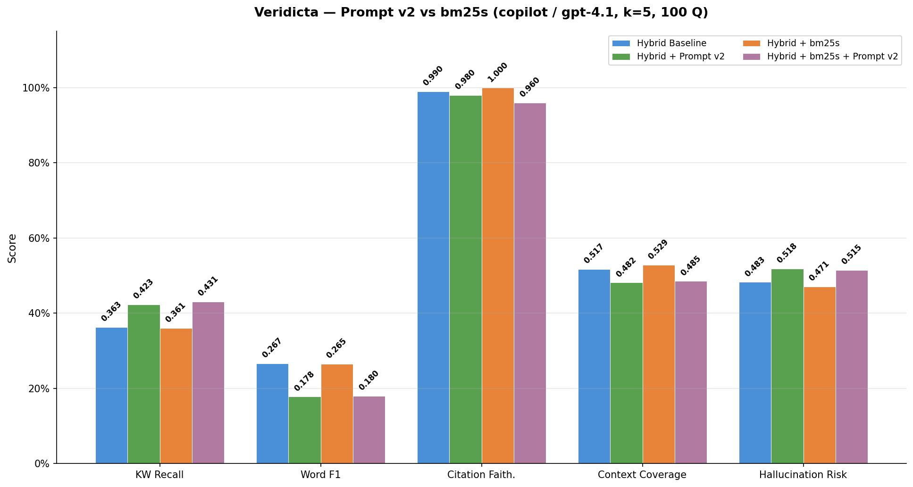
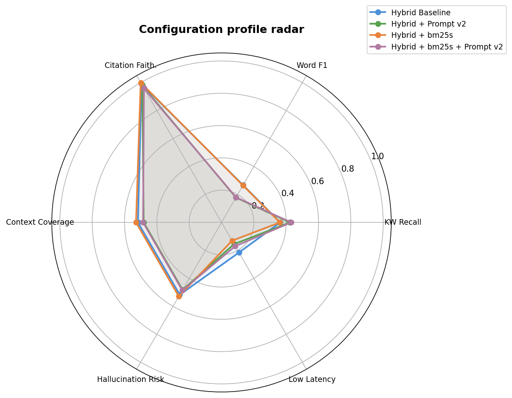
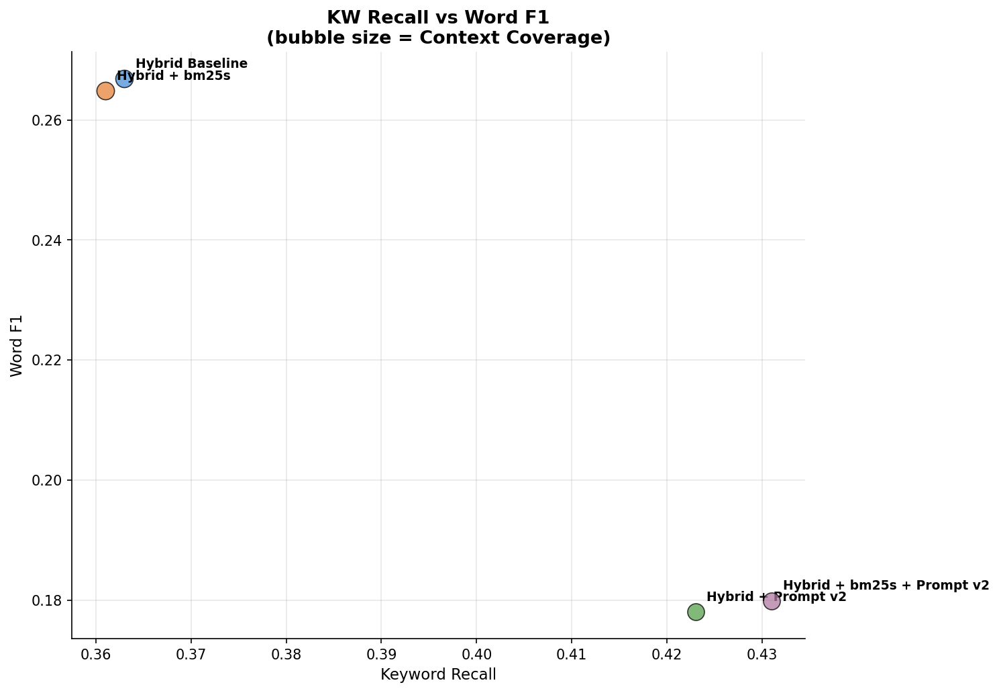
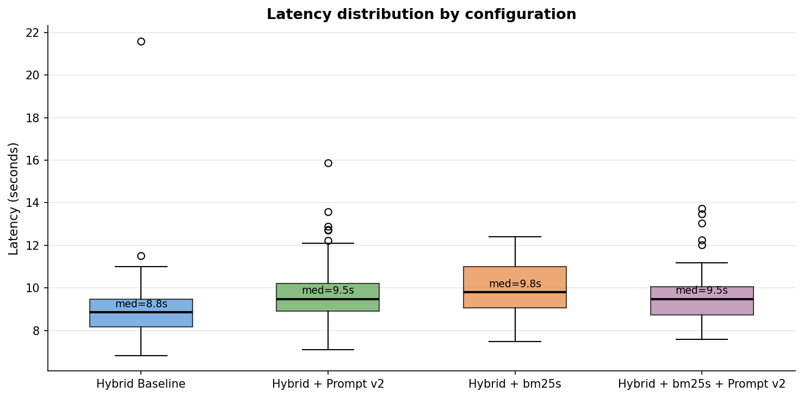
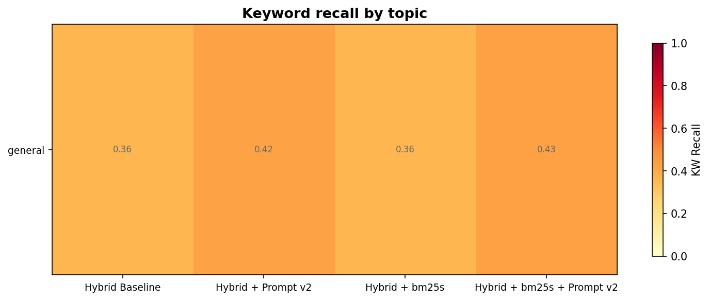

### Phase 14 comparison (100Q)

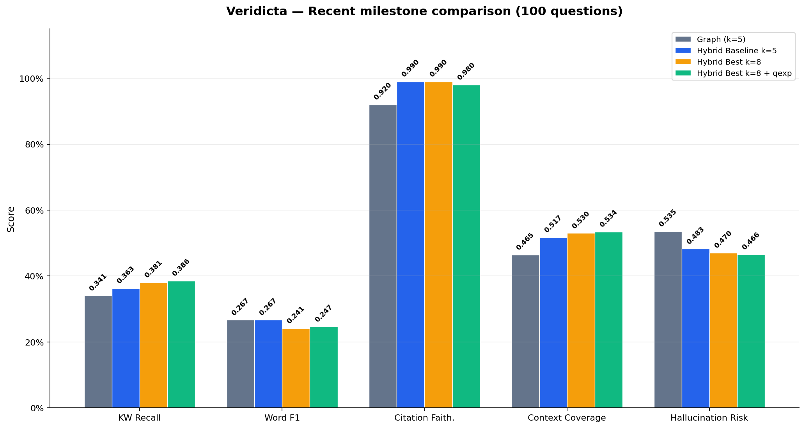
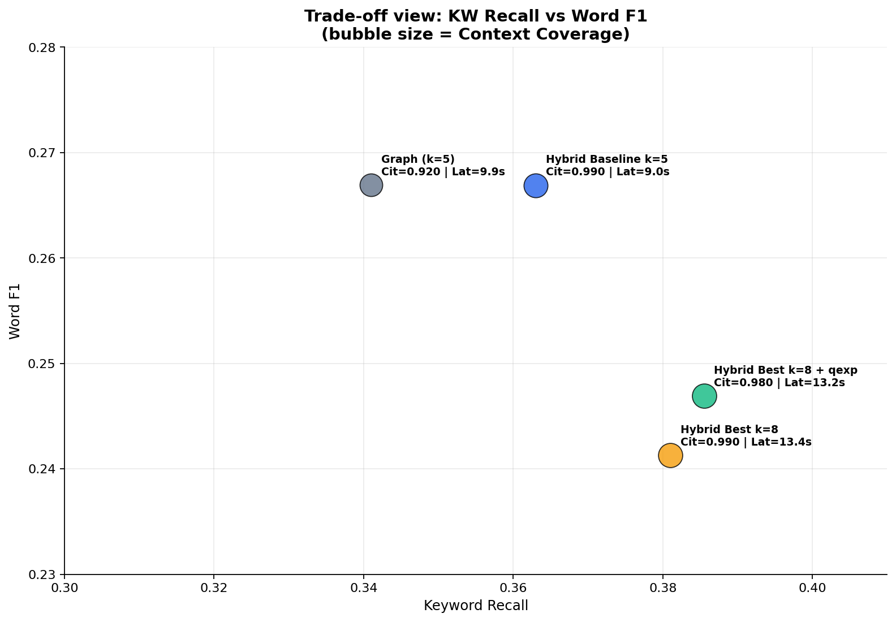
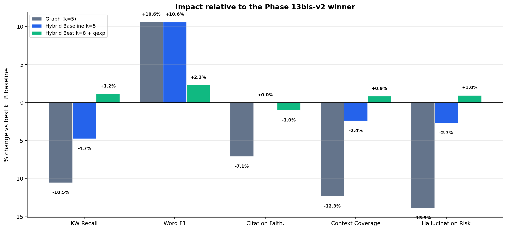
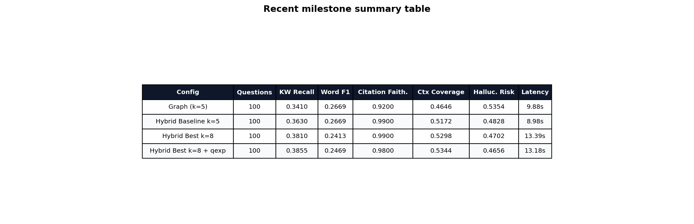

### Reranker tuning (30Q)

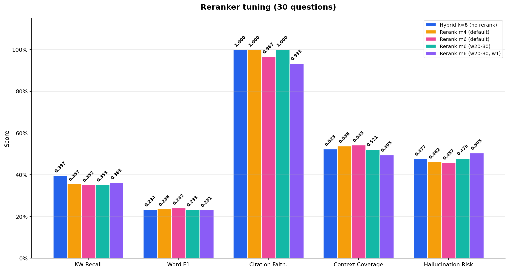
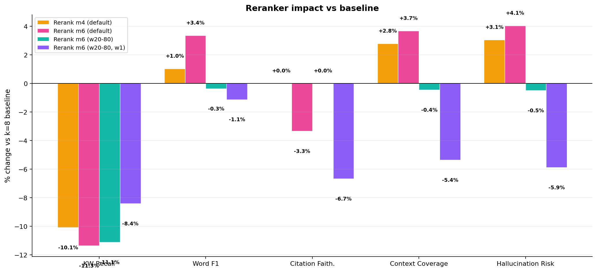
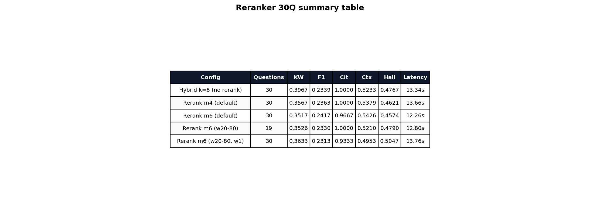

### Solon comparison

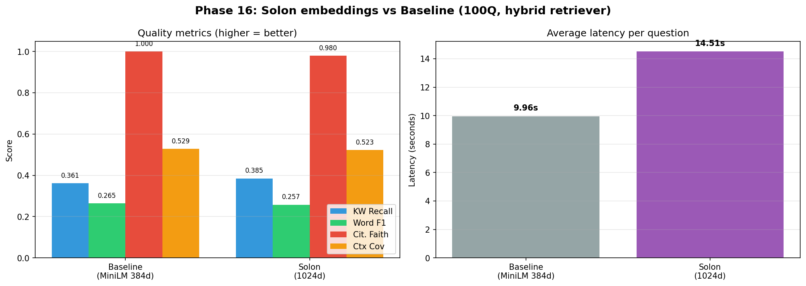

## 13. Changelog

### 2026-03-10

- **Hybrid+Graph RAG** (`hybrid_graph_rag.py`) : BM25+FAISS seed → Neo4j expansion → meilleur F1=0.338
- **LightRAG schema enrichi** : `:Article` nodes + 4 types d'aretes (CITE_ARTICLE, MODIFIE, VOIR_ARTICLE, CONTENU_DANS)
- **Corpus v3** : 49 263 chunks (+85% vs v2) via full crawl LegiMonaco
- **Conversation multi-tour** : 3 derniers echanges + reedition de requete courte
- **Streaming** : token-by-token via `github-copilot-sdk` Python natif (remplacement du bridge Node.js)
- **Visualisations architecture** : 6 graphiques comparatifs dans `eval/charts/architectures/`
- **Tests** : couverture copilot_client 98%, artifacts 82%, neo4j_setup 41% (105 tests)

### 2026-03-09

- Migration sparse retrieval `rank-bm25` → **`bm25s` + `PyStemmer`**
- Prompt engineering v2/v3, FlashRank reranker ONNX, query expansion
- Solon embeddings (1024d), validation KPI finale, traceability + audit JSONL
- Ragas (Faithfulness + ContextPrecision) integre dans le pipeline eval

## 14. Licence

MIT pour le code. Les donnees publiques monegasques sont librement reutilisables pour usage non commercial.

---

Derniere mise a jour : 2026-03-10
